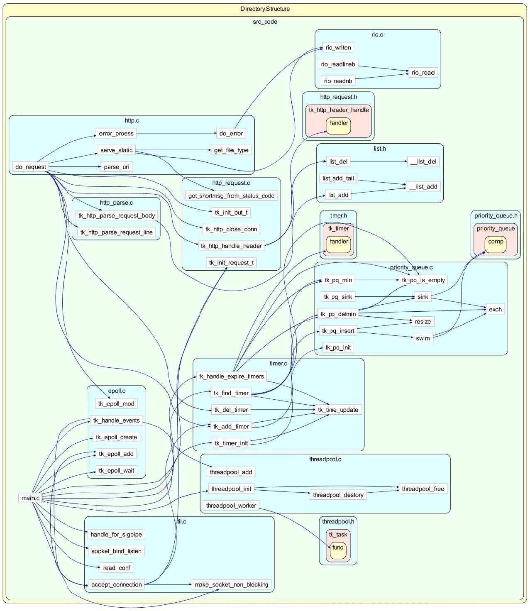

# 主要函数及调用树

## 主要函数

1. util.c

    - 读配置：int read_conf(char* filename, tk_conf_t* conf);

    - 绑定监听：int socket_bind_listen(int port);

    - 处理连接：void accept_connection(int listen_fd, int epoll_fd, char* path);

2. epoll.c

    - 创建epoll：int tk_epoll_create(int flags);

    - 添加到epoll：int tk_epoll_add(int epoll_fd, int fd, tk_http_request_t* request, int events);

    - 从epoll删除：int tk_epoll_del(int epoll_fd, int fd, tk_http_request_t* request, int events);

    - 修改事件状态：int tk_epoll_mod(int epoll_fd, int fd, tk_http_request_t* request, int events);

    - 等待事件：int tk_epoll_wait(int epoll_fd, struct epoll_event* events, int max_events, int timeout);

    - 分发对应事件：void tk_handle_events(int epoll_fd, int listen_fd, struct epoll_event* events, int events_num, char* path);

- http.c

    - 处理请求总入口：void do_request(void* ptr);

    - 解析URI：void parse_uri(char* uri, int length, char* filename, char *query);

    - 获取文件类型：const char* get_file_type(const char* type);

    - 错误信息处理：void do_error(int fd, char* cause, char* err_num, char* short_msg, char* long_msg);

    - 响应静态文件：void serve_static(int fd, char* filename, size_t filesize, tk_http_out_t* out);

- http_parse.c

    - 解析请求行：int tk_http_parse_request_line(tk_http_request_t* request);

    - 解析请求体：int tk_http_parse_request_body(tk_http_request_t* request);

- http_request.c

    - 初始化请求头结构：int tk_init_request_t(tk_http_request_t* request, int fd, int epoll_fd, char* path);

    - 删除请求头结构：int tk_free_out_t(tk_http_out_t* out);

    - 初始化响应结构：int tk_init_out_t(tk_http_out_t* out, int fd);

    - 删除响应头结构：int tk_free_out_t(tk_http_out_t* out);

    - 获取状态码对应提示：const char* get_shortmsg_from_status_code(int status_code);

    - 关闭连接：int tk_http_close_conn(tk_http_request_t* request);

- timer.c

    - 刷新当前时间：void tk_time_update();
    
    - 初始化时间：int tk_timer_init();

    - 新增时间戳：void tk_add_timer(tk_http_request_t* request, size_t timeout, timer_handler_pt handler);

    - 删除时间戳：void tk_del_timer(tk_http_request_t* request);

    - 处理超时：void tk_handle_expire_timers();

- threadpool.c

    - 初始化线程池：tk_threadpool_t* threadpool_init(int thread_num);

    - 添加任务：threadpool_add(tk_threadpool_t* pool, void (* func)(void*), void* arg);

    - 释放线程池及任务：threadpool_free(tk_threadpool_t* pool);

    - 回收线程资源：int threadpool_destory(tk_threadpool_t* pool, int graceful);

    - 工作线程：void* threadpool_worker(void* arg);

## 调用树

---
