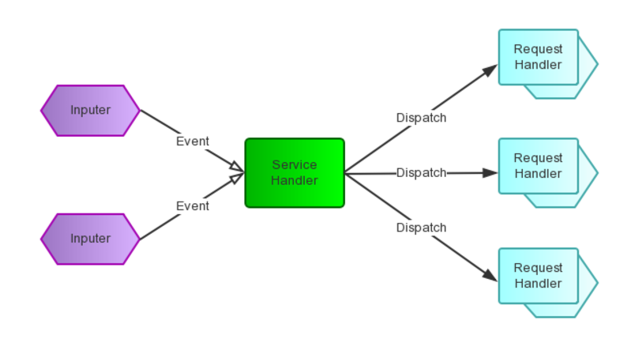

# 并发模型

并发模型主要有多进程模型、多线程模型和事件驱动模型（select, poll, epoll）。多进程模型首先进程比较占资源，切换起来也比较麻烦，况且Linux下最大进程数也有限制，所以不考虑。多线程模型同样有最大线程数限制（主要是单独进程虚地址空间有限），大并发下也不适合。

因为进程创建有一定的开销，所以为了减少创建进程、线程的开销，在并发服务器中也常设置进程池和线程池，这样在有新连接到来时就不需要重新创建造成不必要的开销。除此之外，使用epoll，可以将任务拆分成了独立事件，各个事件可以独立被监视和执行。

- [epoll (kernel 2.6+)](https://banu.com/blog/2/how-to-use-epoll-a-complete-example-in-c/)

- non-blocking I/O

- threadpool

Linux内核2.6之后开始支持epoll，也是本服务器的核心。epoll模型中内核相当于监控代理，监控的粒度为每一个事件，我们把每个完整的处理过程分拆成了多个独立的事件并在epoll中注册，之后监控是否有事件发生的任务就交给内核来做，一旦监测到事件就分发到相应处理模块。就HTTP服务器而言，可以分为以下几步。在创建好了epoll之后：

- 首先需要注册到"监听事件"，之后不需要一直等待下去，直接返回。

- 一旦内核监听到请求就会自动通知可以去建立连接并创建连接描述符，该连接描述符被注册到"读事件"，之后立即返回。

- 用户发送的数据到达服务器，内核感知到读事件，建立任务并放入线程池中。之后唤醒等待任务的worker线程来执行响应操作。

当然，TKeed并不仅仅只用到了epoll和异步非阻塞I/O模型。监听事件最先被注册，在此之后不再阻塞监听，当内核监听到事件发生之后，立即建立连接并注册读事件，读事件并不会阻塞等待用户数据，一直等到内核通知该事件到来才去获取请求，这部分使用的是epoll + 异步非阻塞I/O模型。当请求到达之后，处理请求的操作被放到线程池中，等待多个线程并发响应处理，即使某一线程读取本地文件时被阻塞也会有其他线程可以被调度执行。

之所以选择epoll模型是因为事件驱动适合I/O密集型操作，而HTTP服务器最核心的任务就是响应请求的数据，涉及大量I/O请求。另外当并发量上来之后，传统的多进程、多线程模型虽然并发量很大，但大多处于阻塞状态，即使多为就绪态，系统调度开销也非常大，因此这里使用事件驱动模型无疑更适合。

综上，TKeed核心架构就是同步事件循环 + 非阻塞I/O + 线程池，即Reactor模型。是否同步指的是产生I/O的线程是否会一直等到I/O完成（I/O是否为当前线程完成），若会一直等待I/O完成则是同步I/O，如果将I/O任务"委派"给其他线程完成并通过回调方式通知调用者（即产生I/O线程可以和执行I/O线程并发），此时就是异步。这里是否是阻塞式I/O指的是read或write等系统调用在数据未准备好前是一直阻塞住还是立即返回并设置errno为EAGAIN（+轮询检查）。

很对人对于epoll有所误解，觉得epoll是异步的，但epoll实际上只是通过多路事件分离器分离事件，起到的仅仅是告知某个文件描述符可以读写了，但真正执行I/O的线程依旧是需要等待I/O完成的，此时阻塞I/O会直接阻塞住线程，非阻塞I/O则需要该线程通过轮询方式判断I/O是否就绪（检查EAGAIN）。也就是说epoll并不具有区别同步、异步的属性，区别还是得看产生I/O的线程是如何做的。

与TKeed相对应的模型为Proactor模型，即异步非阻塞I/O模型。从名字也可以看出，二者区别主要在于是同步I/O还是异步I/O，我们可以对比二者执行步骤（以读事件为例）。

- Reactor

    - 应用程序注册读就需事件和相关联的事件处理器。

    - 事件分离器等待事件的发生。

    - 当发生读就需事件的时候，事件分离器调用第一步注册的事件处理器。

    - 事件处理器首先执行实际的读取操作，然后根据读取到的内容进行进一步的处理。

- Proactor

    - 应用程序初始化一个异步读取操作，然后注册相应的事件处理器，此时事件处理器不关注读取就绪事件，而是关注读取完成事件，这是区别于Reactor的关键。

    - 事件分离器等待读取操作完成事件。

    - 在事件分离器等待读取操作完成的时候，操作系统调用内核线程完成读取操作，并将读取的内容放入用户传递过来的缓存区中。这也是区别于Reactor的一点，在Proactor中，应用程序需要传递缓存区。

    - 事件分离器捕获到读取完成事件后，激活应用程序注册的事件处理器，事件处理器直接从缓存区读取数据，而不需要进行实际的读取操作。

从上面可以看出，Reactor和Proactor模式的主要区别就是真正的读取和写入操作是有谁来完成的，Reactor中需要应用程序（TKeed中为worker线程）自己读取或者写入数据，而Proactor模式中，应用程序不需要进行实际的读写过程，操作系统会读取缓存区或者写入缓存区到真正的IO设备。

---