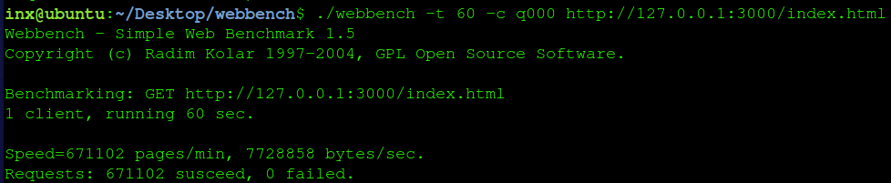
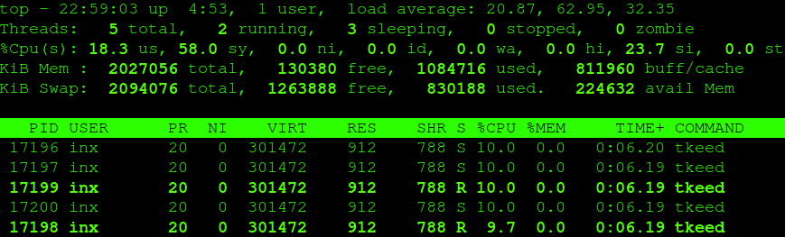
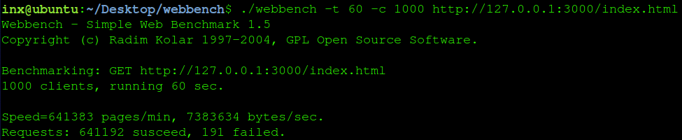
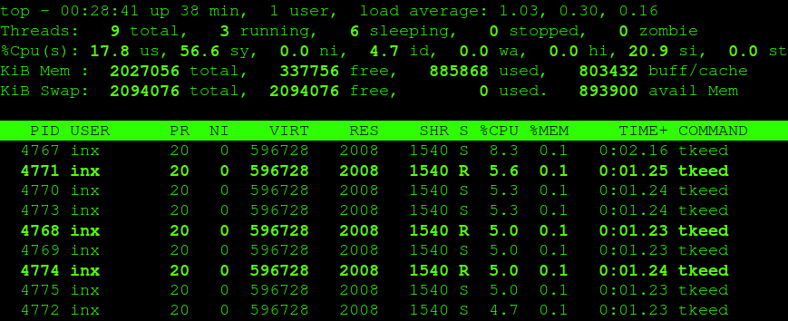
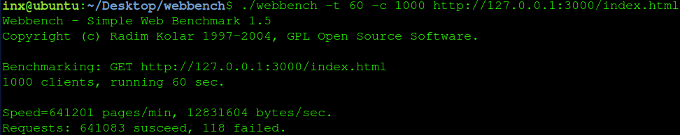

# 测试及改进

## 测试结果

- 测试工具为Webbench，测试时间为60s，并发数及工作线程数为测试内容。

- 测试环境为本地，配置4核心i5处理器。

**1000并发量**

在1K并发量下，并未因线程数增多性能有所提升，相反吞吐量还略微下降并且还有191个failed产生，通常线程数为CPU核心数。在测试中1分钟内4线程下请求671102个页面（515 bytes/page），全部成功。另外，在满负荷情况下TKeed总CPU使用率约40%（10% * 4threads或5% * 8threads）。请求1KB标准页面时，吞吐量稍有下降。

- 4工作线程

    - 性能结果

        

    - 系统负载

        

- 8工作线程（结果）

    - 性能结果
    
        

    - 系统负载

        

- 标准1KB页面测试

    - 性能结果

        

---